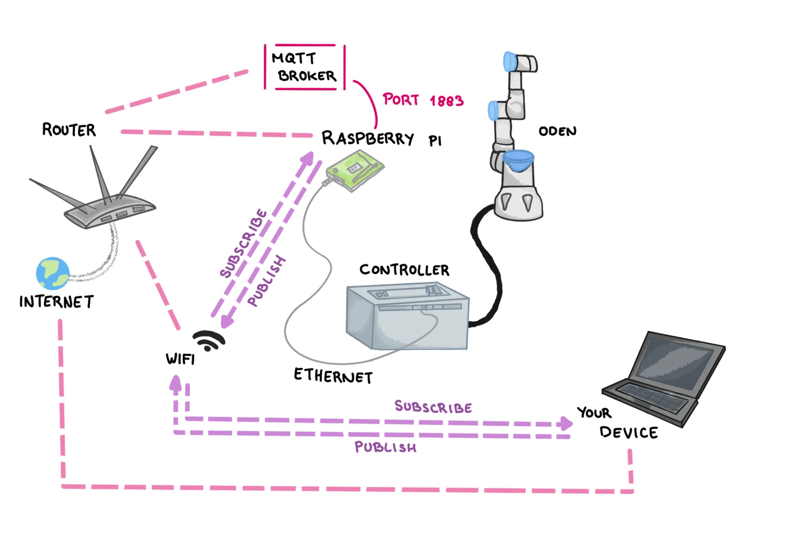

# UR3e MQTT Controller

This script lets you control a **UR3e robot** using MQTT messages sent from a smartphone or any MQTT client. It can trigger robot programs, play local audio, send OSC cues (e.g. to QLab), and enable freedrive mode.

Designed for performances, installations, or research setups involving a UR robot and networked interaction.

---

## Features

- Control `.urp` programs on the robot
- Play local audio files from the controller (e.g. Raspberry Pi)
- Send OSC cues to other systems
- Enter and exit freedrive mode remotely
- Use MQTT messages from any client (including smartphones)

---

## MQTT Dashboard (Android App)

You can use the free [IoT MQTT Panel app](https://play.google.com/store/apps/details?id=snr.lab.iotmqttpanel.prod&hl=en) to create a simple touchscreen dashboard with buttons that send MQTT messages to the robot.

### Example Configuration:
- **Topic:** `robot/scenes`
- **Message Payloads:** `scene_1`, `scene_2`, `free`, `stop`, `pause`, `play`, `audio_test`, `osc_test`, etc.

---

## Installation

### 1. Clone the Repository

```bash
git clone https://github.com/yourusername/ur3e-mqtt-controller.git
cd ur3e-mqtt-controller
````

### 2. Install Python Dependencies

```bash
pip install -r requirements.txt
```

### 3. If Needed (e.g. on Raspberry Pi)

Install system packages for `ur-rtde`:

```bash
sudo apt update
sudo apt install cmake g++ libboost-all-dev python3-dev
```

If the `ur-rtde` Python package still fails to install, refer to the official build instructions:
[https://sdurobotics.gitlab.io/ur\_rtde/](https://sdurobotics.gitlab.io/ur_rtde/)

---

## File Structure

```
your_project/
├── main.py              # Main control script
├── requirements.txt     # Python dependencies
├── audio/               # Audio files for playback
│   └── example.wav
```

---

## Configuration

Open `main.py` and update these variables for your setup:

```python
ROBOT_IP = "10.0.0.3"               # UR robot IP
MQTT_BROKER = "127.0.0.1"           # MQTT broker IP
OSC_TARGET_IP = "192.168.0.115"     # OSC target (e.g. QLab)
AUDIO_BASE_PATH = "/home/pi/audio/" # Path to local audio files
```

Define your scenes:

```python
SCENES = {
    "scene_1": "scene_1.urp",
    "scene_2": "scene_2.urp"
}
```

> Note: The `.urp` files must already be saved on the robot's internal storage. This script only sends commands to load and play them.

---

## Usage

Run the script:

```bash
python main.py
```

Then publish a message to the MQTT topic `robot/scenes` using the IoT MQTT Panel app or another MQTT client.

### Accepted Messages:

| Message      | Action                       |
| ------------ | ---------------------------- |
| `scene_1`    | Loads and plays scene\_1.urp |
| `scene_2`    | Loads and plays scene\_2.urp |
| `free`       | Enters freedrive mode        |
| `stop`       | Stops the robot program      |
| `pause`      | Pauses the robot program     |
| `play`       | Resumes a paused program     |
| `audio_test` | Plays a sample audio file    |
| `osc_test`   | Sends a test OSC cue         |

---

## Setup




